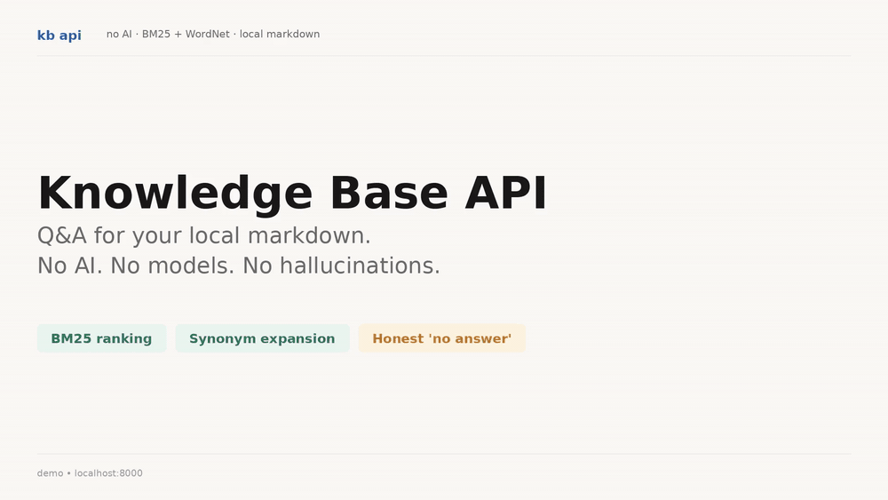

# Knowledge Base API

**Q&A for your local markdown docs. No AI. No models. No hallucinations.**

A self-hosted REST API that answers natural-language questions against a folder of `.md` files using BM25 + POS-aware lemmatization. Returns the matching section verbatim with a confidence score, or honestly admits when it has no answer.



## Why this exists

Every "docs chatbot" today routes user questions through OpenAI or another LLM. For open-source maintainers, privacy-sensitive teams, and air-gapped environments that's either too expensive, too risky, or not allowed. Pure information retrieval gets you ~80% of what people actually want from docs Q&A without sending data anywhere.

The one constraint that took the most work to enforce: **it returns `null` when it has no good match instead of inventing an answer.** Most retrieval systems silently return the least-bad section. This one doesn't.

## Quick start

```bash
# Docker — point at your docs folder, get an endpoint
docker run -v /path/to/your/docs:/app/knowledge -p 8000:8000 kbapi:latest

# Or from source
pip install -r requirements.txt
python download_nltk_data.py
uvicorn app.main:app --port 8000
```

Ask a question:

```bash
curl -X POST localhost:8000/ask \
  -H "Content-Type: application/json" \
  -d '{"question":"how do I add CORS"}'
```

Response:

```json
{
  "answer": "Configure your application using CORSMiddleware...",
  "section": "CORS (Cross-Origin Resource Sharing)",
  "source": "tutorial/cors.md",
  "confidence": 0.93,
  "alternatives": [...]
}
```

When the question has no good match:

```json
{
  "answer": null,
  "section": null,
  "source": null,
  "confidence": 0.0,
  "message": "I don't have enough information to answer that."
}
```

## What makes it different

- **No AI dependency.** BM25 ranking + WordNet synonym expansion + POS-aware lemmatization. Runs on a Raspberry Pi. Indexes 1,800+ markdown sections in under a second.
- **Honest "no answer" path.** When confidence is below threshold, returns `null`. No fabricated content, ever.
- **Identifier-aware tokenizer.** Splits `response_model`, `OAuth2PasswordBearer`, and `Cross-Origin` so users can ask questions the way they're written in code. CORS, JWT, API and other common acronyms expand automatically on the query side.
- **Auto-reindexing.** Drop a new `.md` file in `knowledge/` and the index rebuilds in the background. Atomic swap means in-flight requests aren't disrupted.
- **First-class privacy.** Data never leaves your machine. No API keys. No telemetry. No tracking.

## Endpoints

| Method | Path | Description |
|---|---|---|
| `POST` | `/ask` | Ask a question. Returns best section, confidence, and alternatives. |
| `GET`  | `/health` | Service status and index stats. |
| `POST` | `/reload` | Trigger a manual reindex. |
| `GET`  | `/sections` | List every indexed section. |

## Configuration

All settings are environment variables with safe defaults:

| Variable | Default | Purpose |
|---|---|---|
| `KNOWLEDGE_DIR` | `knowledge/` | Root directory containing `.md` files. |
| `CONFIDENCE_THRESHOLD` | `0.1` | Minimum raw BM25 score to return a result. |
| `SCORE_SCALE` | `25.0` | Divisor mapping raw scores to 0.0–1.0 confidence. |
| `MAX_RESULTS` | `3` | Maximum alternatives returned. |
| `WATCHER_DEBOUNCE_MS` | `500` | Wait this long after file changes before reindex. |
| `MAX_SYNONYMS_PER_TOKEN` | `2` | WordNet synonyms added per query noun/verb. |
| `HEADING_BOOST_FACTOR` | `2.0` | Boost when query overlaps section heading. |
| `HEADING_OVERLAP_THRESHOLD` | `0.5` | Min heading-query overlap to trigger boost. |
| `FILENAME_BOOST_FACTOR` | `1.4` | Boost when query overlaps source filename. |
| `REFERENCE_PATH_BOOST` | `1.2` | Extra boost for sections under `reference/`. |

## Architecture

```
knowledge/ (markdown)
   |
   v
[ markdown-it-py ] -> Section objects
   |
   v
[ NLTK tokenize -> identifier split -> POS-tag -> lemmatize -> stopword filter ]
   |
   v
[ BM25Okapi index ] -- atomic swap on reindex

Query
   |
   v
[ same NLP pipeline ] -> tokens
   |
   v
[ acronym expansion ] [ synonym expansion ]
   |
   v
[ BM25 scoring -> heading boost -> filename boost -> threshold gate ]
   |
   v
{ answer, section, source, confidence, alternatives } | null
```

## Use cases

- **OSS maintainers** — docs Q&A for your project without paying for LLM API calls. Ship as a GitHub Action.
- **Internal team wikis** — answer questions over your Confluence/Notion exports without sending them to OpenAI.
- **Air-gapped environments** — finance, healthcare, defense — where LLM endpoints aren't an option.
- **Personal knowledge management** — query your Obsidian/Logseq vault offline.

## What it doesn't do

Being honest about scope:

- No synthesis. The `answer` field is the matching section's body, not a paraphrase.
- No conversational follow-up. Each query is independent.
- No multi-language support yet (English-only NLTK stack).
- Not a Perplexity replacement. If you ask open-domain questions outside your corpus, you'll get `null`. That's the feature.

## Tech stack

- **FastAPI** + **Uvicorn** for the API
- **rank-bm25** for BM25Okapi
- **NLTK** (WordNet, Penn Treebank tagger, stopwords) for tokenization and lemmatization
- **markdown-it-py** for correct handling of fenced code blocks during parsing
- **watchdog** for file-system monitoring

Runs in ~40 MB RAM. 1,800 sections index in well under a second.

## Testing

```bash
pip install -r requirements-dev.txt
pytest
```

59 tests covering tokenization, indexing, search, watcher, API endpoints, and config.

## License

MIT.
